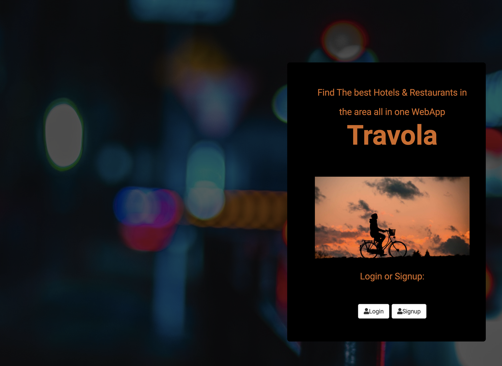
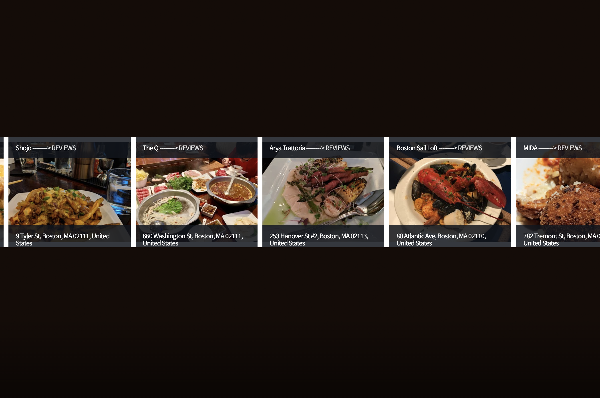
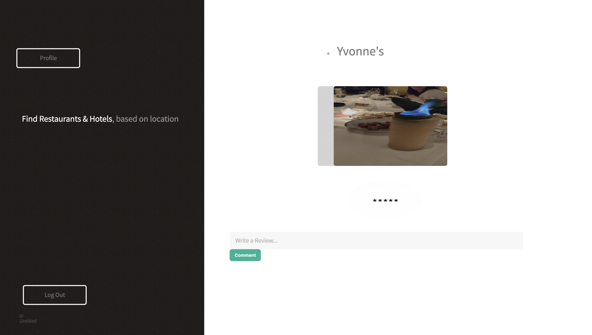

# Demo Day Project

## My Demo Day Project will feature a full stack application that enables a user to allocate restaurants, hotels, weather and means of transportation just by providing their location

## First page

## Sign-up/Sign-in page

## Restaurants & Hotel search results page

## Technologies used:
1. EJS
2. CSS
3. Javascript
4. MongoDb
5. Express]
## Installation

1. Clone repo
2. run `npm install`

## Usage

1. run `node server.js`
2. Navigate to `localhost:8080`
